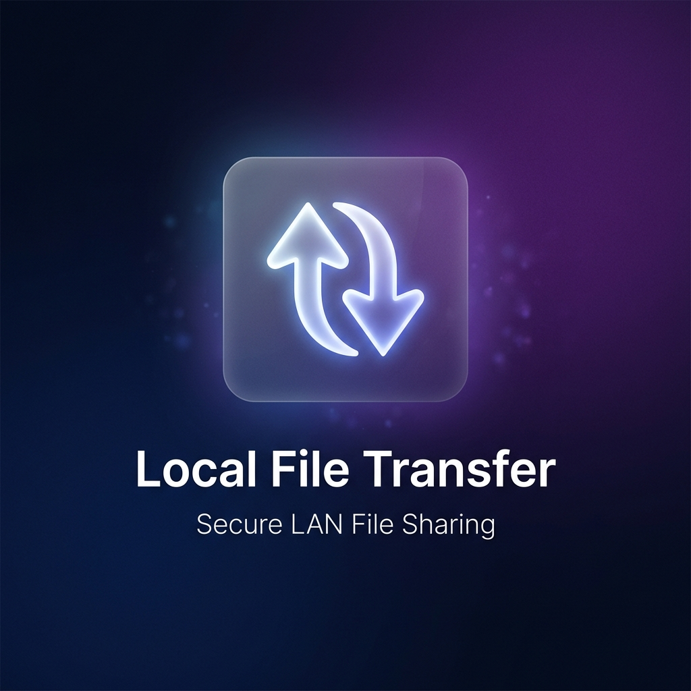
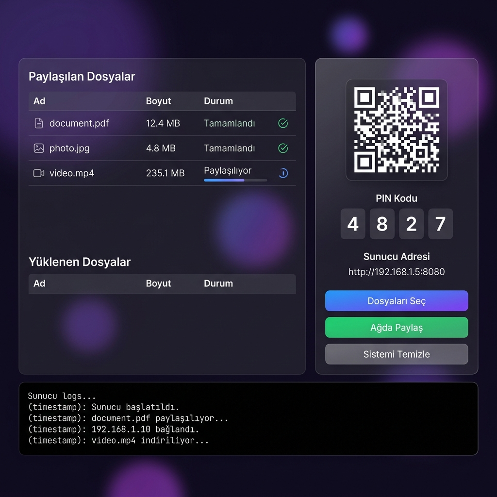
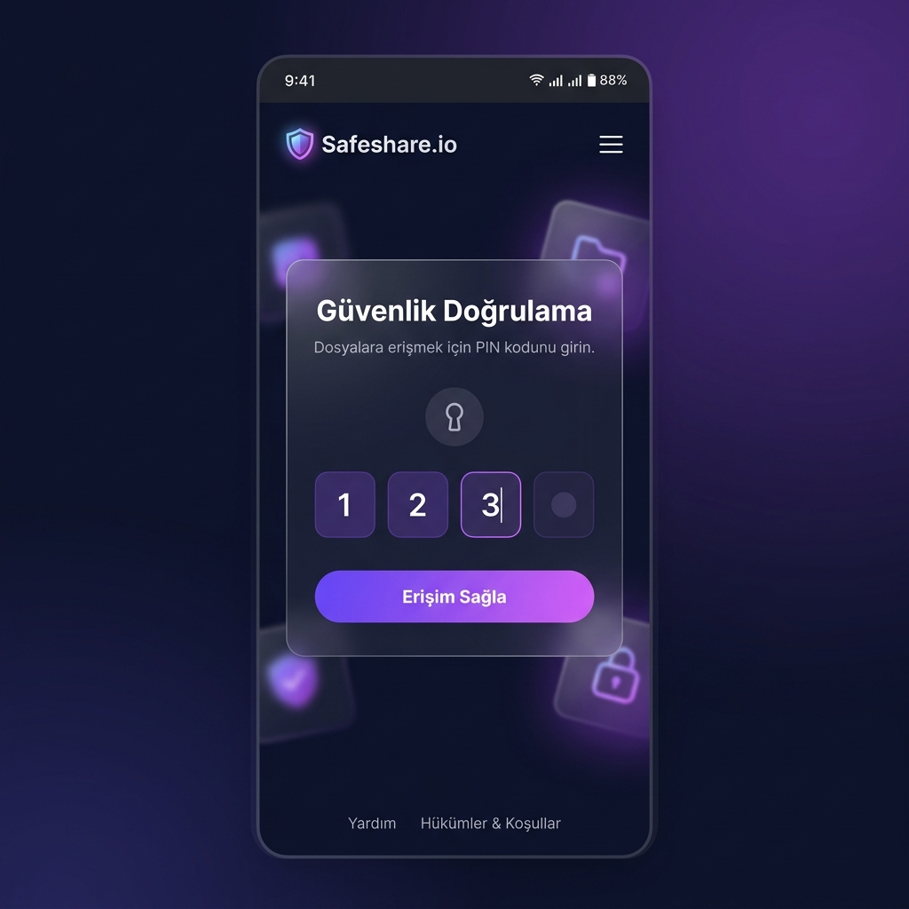

<p align="center">
  
</p>

<p align="center">
  
</p>

<h1 align="center">Local File Transfer</h1>

<p align="center">
  <strong>Yerel ağda güvenli, hızlı ve çift yönlü dosya paylaşım uygulaması</strong>
</p>

<p align="center">
  
  
  
  
</p>

<p align="center">
  <a href="#-hakkında">Hakkında</a> •
  <a href="#-özellikler">Özellikler</a> •
  <a href="#-kurulum">Kurulum</a> •
  <a href="#%EF%B8%8F-adım-adım-kullanım-rehberi">Kullanım Rehberi</a> •
  <a href="#-teknolojiler">Teknolojiler</a>
</p>

---

## 📖 Hakkında

**Local File Transfer**, aynı Wi-Fi ağındaki cihazlar arasında dosya paylaşımını kolaylaştıran bir masaüstü uygulamasıdır. Herhangi bir bulut hizmeti veya internet bağlantısı gerektirmeden, yerel ağ üzerinden güvenli ve hızlı dosya transferi sağlar.

Bilgisayarınızdan telefonunuza, telefonunuzdan bilgisayarınıza — **çift yönlü** dosya aktarımı yapabilirsiniz. Karşı cihaza herhangi bir uygulama yüklemenize gerek yok; tarayıcı üzerinden her şeyi yapabilirsiniz.

---

## ✨ Özellikler

| Özellik | Açıklama |
|---------|----------|
| 🔄 **Çift Yönlü Transfer** | Hem indirme hem yükleme desteği — bilgisayardan telefona ve telefondan bilgisayara |
| 🔒 **PIN Güvenliği** | 4 haneli rastgele PIN kodu ile yetkisiz erişimi engeller |
| 📱 **QR Kod** | Telefonunuzla QR kodu okutarak anında bağlanın |
| 🌐 **Tarayıcı Tabanlı** | Karşı cihaza uygulama yüklemeye gerek yok — sadece tarayıcı yeterli |
| 📂 **Çoklu Dosya** | Birden fazla dosyayı aynı anda seçip paylaşabilirsiniz |
| 🖱️ **Sürükle & Bırak** | Web arayüzünde dosyaları sürükleyerek kolayca yükleyin |
| 📊 **Gerçek Zamanlı Log** | Tüm transfer işlemlerini anlık olarak takip edin |
| 🔔 **Bildirimler** | Dosya yüklendiğinde masaüstü bildirimi alın |
| 🎨 **Modern Arayüz** | Glassmorphism tasarım, animasyonlar ve karanlık tema |

---

## 📸 Ekran Görüntüleri

<p align="center">
  
  <br>
  <em>Masaüstü uygulaması — Dosya yönetimi, QR kod ve sunucu logları</em>
</p>

<p align="center">
  
  <br>
  <em>Mobil web arayüzü — PIN girişi ve dosya indirme/yükleme</em>
</p>

---

## 🚀 Kurulum

### Gereksinimler

Uygulamayı çalıştırmak için bilgisayarınızda şunların kurulu olması gerekir:

- **[Node.js](https://nodejs.org/)** (v18 veya üzeri) — JavaScript çalışma ortamı
- **npm** — Paket yöneticisi (Node.js ile birlikte otomatik olarak yüklenir)
- **[Git](https://git-scm.com/)** — Projeyi indirmek için (opsiyonel, ZIP olarak da indirebilirsiniz)

> **Node.js nasıl kurulur?**
> 1. [nodejs.org](https://nodejs.org/) adresine gidin
> 2. **LTS** (Long Term Support) sürümünü indirin
> 3. Kurulum sihirbazını takip edin (varsayılan ayarlarla ilerleyin)
> 4. Kurulumu doğrulamak için terminalde `node --version` yazın

### Yöntem 1: Git ile Kurulum

Terminali (PowerShell, CMD veya Git Bash) açın ve şu komutları sırasıyla çalıştırın:

```bash
# 1. Projeyi bilgisayarınıza indirin
git clone https://github.com/tariksnmz58/Local-File-Transfer.git

# 2. İndirilen proje klasörüne girin
cd Local-File-Transfer

# 3. Gerekli paketleri yükleyin (bu adım ilk seferde 1-2 dk sürebilir)
npm install

# 4. Uygulamayı başlatın
npm start
```

### Yöntem 2: ZIP ile Kurulum

Git kullanmak istemiyorsanız:

1. Bu sayfanın üst kısmındaki yeşil **"Code"** butonuna tıklayın
2. **"Download ZIP"** seçeneğini seçin
3. İndirilen ZIP dosyasını çıkartın
4. Çıkartılan klasöre terminalde girin ve `npm install` ardından `npm start` çalıştırın

### Kurulabilir .exe Oluşturma (Opsiyonel)

Uygulamayı Windows kurulum dosyası (.exe) olarak oluşturmak isterseniz:

```bash
npm run build
```

Oluşturulan kurulum dosyası `dist/` klasöründe bulunur. Bu dosyayı başka bilgisayarlara da kurabilirsiniz.

---

## 🖥️ Adım Adım Kullanım Rehberi

### Ön Koşullar

> ⚠️ **Önemli:** Dosya paylaşımının çalışması için her iki cihaz da (bilgisayar + telefon) **aynı Wi-Fi ağına** bağlı olmalıdır.

### 1. Uygulamayı Başlatın

Terminalde `npm start` komutunu çalıştırın veya oluşturduğunuz .exe dosyasını açın. Uygulama karanlık temalı modern arayüzle açılacaktır.

### 2. Dosyaları Seçin

- Sol paneldeki veya sağ paneldeki **"📁 Dosyaları Seç"** butonuna tıklayın
- Açılan dosya seçme penceresinden paylaşmak istediğiniz dosyaları seçin
- **Birden fazla dosya** seçebilirsiniz (Ctrl tuşuna basılı tutarak)
- Seçilen dosyalar sol paneldeki tabloda listelenecektir

### 3. Sunucuyu Başlatın

- **"🌐 Ağda Paylaş"** butonuna tıklayın
- Uygulama otomatik olarak şunları yapacaktır:
  - Yerel HTTP sunucusunu başlatır (varsayılan port: 8080)
  - Rastgele 4 haneli **PIN kodu** üretir
  - **QR kodu** oluşturur
  - Sunucu adresini gösterir (örn: `http://192.168.1.5:8080`)

### 4. Telefonunuzdan Bağlanın

Telefonunuzdan bağlanmanın **iki yolu** vardır:

#### Yol A: QR Kod ile (Önerilen) 📱
1. Telefonunuzun kamerasını açın
2. Ekrandaki **QR kodu** okutun
3. Açılan bağlantıya tıklayın
4. Tarayıcıda PIN giriş sayfası açılacak

#### Yol B: Manuel Adres ile 🔗
1. Telefonunuzun tarayıcısını açın (Chrome, Safari vb.)
2. Adres çubuğuna ekranda gördüğünüz adresi yazın (örn: `http://192.168.1.5:8080`)
3. PIN giriş sayfası açılacak

### 5. PIN Kodunu Girin

- Masaüstü uygulamasında gösterilen **4 haneli PIN kodunu** telefonunuzdaki giriş ekranına yazın
- **"Erişim Sağla"** butonuna tıklayın
- Doğru PIN girildiğinde dosya listesi ekranı açılır

### 6. Dosyaları İndirin (Bilgisayar → Telefon) ⬇️

- **"⬇ İndir"** sekmesinde paylaşılan dosyalar listelenir
- İndirmek istediğiniz dosyanın yanındaki **"İndir"** butonuna tıklayın
- Dosya telefonunuza indirilecektir
- Masaüstü uygulamasında indirme durumu anlık olarak güncellenir

### 7. Dosya Yükleyin (Telefon → Bilgisayar) ⬆️

- **"⬆ Yükle"** sekmesine geçin
- Dosyaları sürükleyip bırakın veya **"dosya seçin"** bağlantısına tıklayın
- İlerleme çubuğu yükleme durumunu gösterir
- Yükleme tamamlandığında bilgisayarda masaüstü bildirimi alırsınız
- Yüklenen dosyalar `İndirilenler/DosyaPaylasim-Yuklemeler` klasörüne kaydedilir

### 8. Oturumu Sonlandırın

- İşiniz bittiğinde **"🔄 Sistemi Temizle"** butonuna tıklayın
- Sunucu durdurulur, dosya listesi ve PIN kodu sıfırlanır

---

## ❓ Sık Sorulan Sorular

<details>
<summary><strong>Telefonda "sayfa bulunamadı" hatası alıyorum</strong></summary>

- Her iki cihazın da **aynı Wi-Fi ağında** olduğundan emin olun
- VPN kullanıyorsanız **kapatın**
- Bilgisayarınızın güvenlik duvarı (firewall) bağlantıyı engelliyor olabilir — ilk çalıştırmada güvenlik duvarı izin isteyecektir, **"İzin Ver"** seçin
</details>

<details>
<summary><strong>Port 8080 kullanımdaysa ne olur?</strong></summary>

Uygulama otomatik olarak bir sonraki boş portu dener (8081, 8082...). Log panelinde hangi portta çalıştığını görebilirsiniz.
</details>

<details>
<summary><strong>Hangi dosya türlerini paylaşabilirim?</strong></summary>

Tüm dosya türlerini paylaşabilirsiniz: belgeler, fotoğraflar, videolar, müzikler, ZIP arşivleri, kurulum dosyaları ve daha fazlası. Herhangi bir dosya boyutu sınırı yoktur.
</details>

<details>
<summary><strong>Verilerim güvende mi?</strong></summary>

Evet! Dosyalar sadece yerel ağınız üzerinden aktarılır, hiçbir bulut sunucusuna gönderilmez. Ayrıca PIN kodu koruması sayesinde aynı ağdaki başkaları dosyalarınıza erişemez.
</details>

<details>
<summary><strong>macOS veya Linux'ta çalışır mı?</strong></summary>

Electron tabanlı olduğu için teorik olarak çalışır, ancak şu an sadece Windows için build yapılandırması mevcuttur. `npm start` komutu tüm platformlarda çalışır.
</details>

---

## 🛠️ Teknolojiler

| Teknoloji | Kullanım Amacı |
|-----------|---------------|
| **[Electron](https://www.electronjs.org/)** | Masaüstü uygulama çatısı — web teknolojileriyle masaüstü uygulama |
| **Node.js HTTP** | Yerleşik HTTP sunucusu — yerel dosya transfer sunucusu |
| **[QRCode](https://www.npmjs.com/package/qrcode)** | QR kod oluşturma — hızlı mobil bağlantı |
| **HTML / CSS / JS** | Uygulama ve web arayüzü — modern, responsive tasarım |
| **[electron-builder](https://www.electron.build/)** | Windows .exe kurulum dosyası oluşturma |

---

## 📁 Proje Yapısı

```
Local-File-Transfer/
│
├── main.js              # Ana süreç: HTTP sunucu, dosya yönetimi, IPC
├── preload.js           # Güvenli köprü: renderer ↔ main iletişimi
├── renderer.js          # Arayüz mantığı: buton olayları, UI güncellemeleri
├── index.html           # Masaüstü uygulama HTML yapısı
├── style.css            # Glassmorphism tasarım ve animasyonlar
├── package.json         # Proje yapılandırması ve bağımlılıklar
│
├── assets/
│   ├── icon.png         # Uygulama ikonu
│   ├── banner.png       # README banner görseli
│   ├── screenshot-desktop.png
│   └── screenshot-mobile.png
│
└── .gitignore           # Git'in takip etmeyeceği dosyalar
```

---

## 🔐 Güvenlik

| Koruma | Açıklama |
|--------|----------|
| 📌 **PIN Koruması** | Her oturumda rastgele 4 haneli PIN üretilir, yanlış PIN ile erişim engellenir |
| 🛡️ **Yerel Ağ** | Veriler internet üzerinden değil, sadece yerel Wi-Fi ağı üzerinden iletilir |
| 🚫 **VPN Filtresi** | VPN, Docker, VirtualBox gibi sanal adaptörler otomatik olarak filtrelenir |
| 🔒 **Bulut Yok** | Hiçbir veri üçüncü parti sunuculara gönderilmez — her şey sizin ağınızda kalır |
| 🧹 **Oturum Sıfırlama** | "Sistemi Temizle" ile tüm paylaşım verileri ve PIN anında silinir |

---

## 🤝 Katkıda Bulunma

Projeye katkıda bulunmak isterseniz:

1. Bu repoyu **Fork** edin
2. Yeni bir **branch** oluşturun (`git checkout -b feature/yeni-ozellik`)
3. Değişikliklerinizi **commit** edin (`git commit -m "feat: Yeni özellik eklendi"`)
4. Branch'inizi **push** edin (`git push origin feature/yeni-ozellik`)
5. Bir **Pull Request** açın

---

## 👤 Geliştirici

<p align="center">
  <strong>Tarık Sönmez</strong><br>
  <a href="https://github.com/tariksnmz58">GitHub @tariksnmz58</a>
</p>

---

## 📄 Lisans

Bu proje [ISC](https://opensource.org/licenses/ISC) lisansı altında lisanslanmıştır.

---

<p align="center">
  ⭐ Bu projeyi beğendiyseniz yıldız vermeyi unutmayın!
</p>
